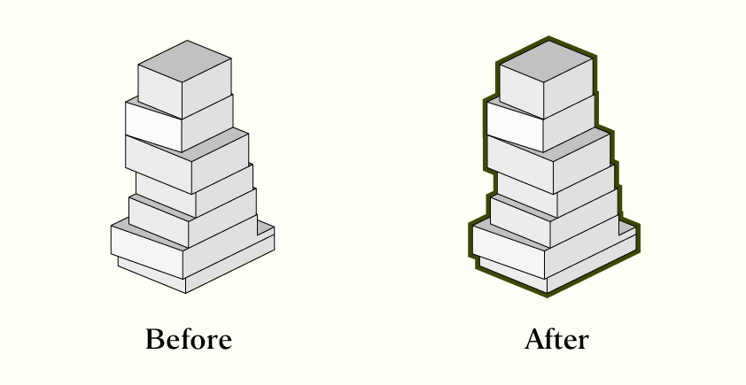

# IllustratorScript
**A collection of tools and scripts to supercharge your Adobe Illustrator workflow**

## Introduction
IllustratorScript is a comprehensive project integrating various tools and features to enhance productivity in Adobe Illustrator. Designed for designers, architects, and creators, this project automates repetitive tasks and introduces innovative ways to streamline your workflow.

### Tool-000: Automatic Outline Effects for Geometry(自動量體圖形外框效果)
- **Purpose**: Quickly adds outer outlines to SketchUp-exported geometry.
- **Benefit**: Saves time and ensures consistent graphics for professional projects.
 
[![Watch the video]](https://youtu.be/uz0WMM3wSlw)

## Installation Guide
### 繁體中文
1. 將 `.jsx` 文件複製到以下路徑： 
2. 如果您使用的是不同版本的 Adobe Illustrator，請根據您的軟體版本調整路徑，例如 `Adobe Illustrator 2024`。
3. 注意：`Presets` 資料夾後的路徑會根據語言不同而有所不同。請確認您的語言設定是否為 `zh_TW`（繁體中文）。
ex:C:\Program Files\Adobe\Adobe Illustrator 2025\Presets\zh_TW\指令檔

### English
1. Copy the `.jsx` file to the following path:  
2. If you're using a different version of Adobe Illustrator, adjust the path according to your software version, such as `Adobe Illustrator 2024`.
3. Note: The path after `Presets` may vary depending on the language of your Illustrator installation. Ensure your language setting is `en_US` (English).
ex:C:\Program Files\Adobe\Adobe Illustrator 2025\Presets\en_US\Scripts

### How to Run
1. Open Adobe Illustrator.
2. In the main menu, go to **File > Scripts**.
3. Find the `.jsx` file you copied and click to execute it.

## Support
willywang@cyberavocado.com

## License
This project is licensed under the MIT License. See the LICENSE file for details.
